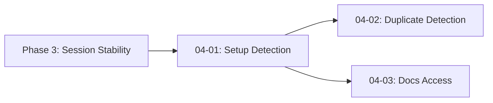

# Phase 4 Plan 1: Setup Detection and Template Seeding Summary

**Phase:** 04-setup-flow-templates
**Plan:** 01
**Subsystem:** Setup Flow
**Status:** Complete
**Completed:** 2026-02-27

## One-Liner

Automatic setup detection prompts users when .carl/ is missing and seeds starter templates via `/carl setup` command with idempotent file operations.

## Dependency Graph



- **requires:** Phase 3 (rule-cache, paths module)
- **provides:** Setup detection, template seeding, `/carl setup` command
- **affects:** All downstream phases that need user onboarding

## Tech Stack

### Added
- None (uses Node.js built-ins: fs, path, os)

### Patterns
- Idempotent file operations (skip existing files)
- Process-level singleton guard for setup check
- Async setup execution with progress feedback

## Files

### Created
- `src/carl/setup.ts` - Setup flow logic with template seeding

### Modified
- `src/integration/plugin-hooks.ts` - Setup detection and command handler integration

## Tasks Completed

| Task | Name | Commit | Status |
|------|------|--------|--------|
| 1 | Create setup.ts with template seeding logic | 661fa91 | ✓ |
| 2 | Integrate setup detection into plugin-hooks.ts | ce7c28a | ✓ |
| 3 | Add /carl setup command handler | 719695c | ✓ |

## Decisions Made

1. **Setup detection on first hook invocation** - Uses `setupChecked` process-level guard to check once per process lifetime, not per session
2. **Idempotent seeding** - Never overwrites existing files, only copies missing ones
3. **Project-first with global fallback** - Tries project `.carl/` first, falls back to `~/.carl/` if project not writable
4. **Non-blocking prompt** - Setup prompt is injected into `output.system`, user decides whether to run setup

## Verification Results

```bash
# Task 1: setup.ts exports
$ grep -E "(checkSetupNeeded|seedCarlTemplates|buildSetupPrompt|runSetup)" src/carl/setup.ts
export function checkSetupNeeded(...)
export async function seedCarlTemplates(...)
export function buildSetupPrompt(): string
export async function runSetup(...)

# Task 2: plugin-hooks integration
$ grep -E "(setupChecked|checkSetupNeeded|buildSetupPrompt)" src/integration/plugin-hooks.ts
import { checkSetupNeeded, buildSetupPrompt, runSetup } from "../carl/setup";
let setupChecked = false;
if (!setupChecked) { setupChecked = true; ... }

# Task 3: command handler
$ grep -E "carl setup|carl-setup" src/integration/plugin-hooks.ts
if (commandName === "carl setup" || commandName === "carl-setup") { ... }
```

## Deviations from Plan

None - plan executed exactly as written.

## Authentication Gates

None required for this plan.

## Next Phase Readiness

- [x] Setup prompt appears when .carl/ is missing
- [x] `/carl setup` command triggers template seeding
- [x] Existing files are preserved (idempotent)
- [x] No blocking behavior - setup is non-intrusive

**Blockers:** None

---

*Duration: ~5 minutes*
*Commits: 3*
*Files: 2 (1 created, 1 modified)*
